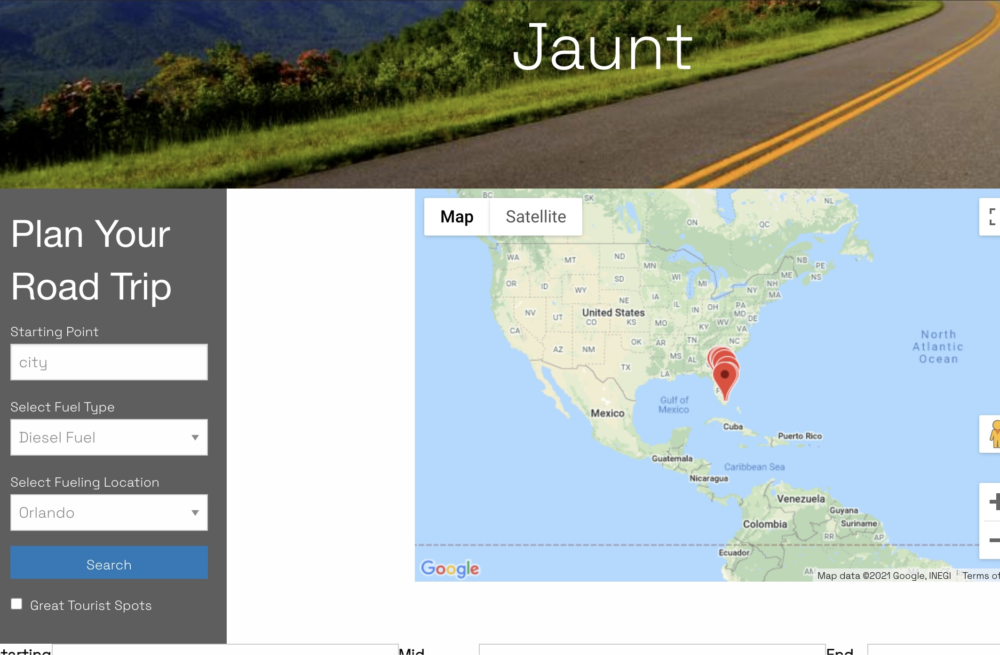

#  ProjectOne: Creating a fully functioning application using API's

# Project Purpose

One of the major important steps in becoming a full stacked developer is knowing how to create an application from scratch. The knowledge to build the front-end and back-end of an applicaiton is key to becoming an attractive reliable asset to potential employers, and overall having the knowledge and ability to create fully functioning applications. In this following project we are using our newly acquired skills to build a new application from scratch from an idea brainstormed within the group. For each group we needed to develop with an idea for an application that can potetnially solve an everday, real-world issue.
The goal for this project is work collaboratively with members of a group to create an applciation using two server-side API's. From the abiliy to creating a fully functioning application with two server-side API's we will learn agile development methodologies and  gain the abiliy to implement feature and do bug fixes using the git branch workflow and pull requests, also expanding our knowledge on what github can do. 

# Project Inspiration
  Our inspiration for our project is to create a road trip all in one application. Currently in beta, we used the google maps api to create a fully funcitioning map with limited but accurate routes from city to city with the miles between cities calculated. Also with the same api, we were able to create infowindows for markers displayed on the map, with its purpose to show potential sight seeing destinations along the way. Secondly, we used the collect gas api to have gas prices displayed for potential cities the user would pass by during his/her roadtrip. From this application we have gained the vision and passion to continue developing this applcation to build it to its full potential and live up to the vision we have for it, adding more function to it as we progress with our developing skills.  

  
# Project Layout 

# Webpage URL:
https://kevinrhidalgo.github.io/SuperGroup-ProjectOne-/

# Tools Used
1. Google Maps API
2. Google CSS Framework
3. Collect Api (specifically gas api)
4. VS code
5. Github
6. Foundation Framework

# Group Name: 
SuperGroup 

# Group Members
1. Patrick Moore
2. Trent Heier
3. Kevin Hidalgo

